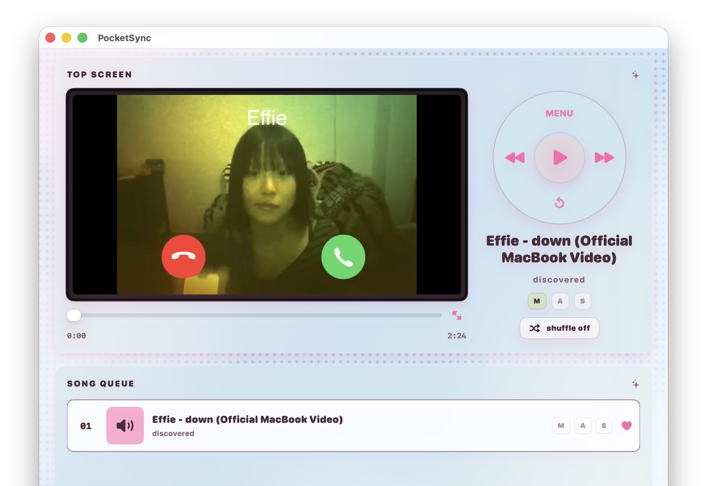
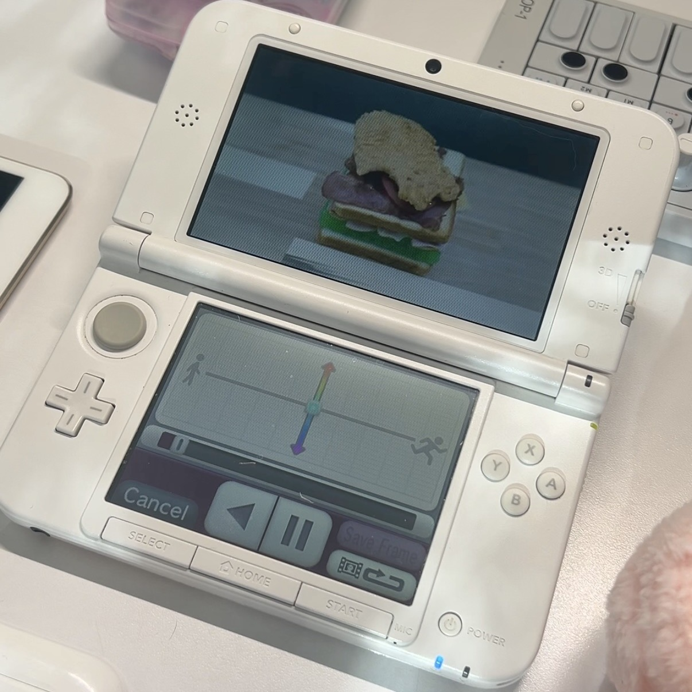

# PocketSync

A macOS app for converting music videos to Nintendo 3DS AVI format, managing a video library, and watching it on shuffle.

<p align="center">
    
</p>

## Why I built it

I wanted to watch music videos on my Nintendo 3DS. PocketSync grew out of figuring out the conversion process and making it easier to repeat. It also became a video player I like to leave running on a second monitor, shuffling through old music videos.

Read more about the process on [my project page](https://www.marcoortiztorres.com/projects/pocketsync).

## What it does

- Imports local videos and folders into a library.
- Converts videos to AVI for playback on a Nintendo 3DS.
- Creates MP4 copies for playback on the Mac.
- Syncs converted videos to an SD card using Nintendo-style filenames.
- Plays your library with shuffle and searchable queues.
- Lets you edit video metadata and choose where your library lives.
- Supports custom local plugins for importing videos and metadata.

## On the 3DS

<p align="center">
    
</p>

A video converted with PocketSync, playing on a Nintendo 3DS XL.

## Getting started

### Requirements

- macOS 26.2 or later, the current project deployment target.
- Xcode with support for that macOS target to build from source.
- A separately installed FFmpeg for video conversion, with the encoders used below available.
- An SD card and a way to connect it to your Mac if you want to transfer videos to a 3DS.

PocketSync looks for FFmpeg at `/opt/homebrew/bin/ffmpeg`, `/usr/local/bin/ffmpeg`, or `/usr/bin/ffmpeg`.

### Build and run

1. Clone or download this repository.
2. Open `PocketSync.xcodeproj` in Xcode.
3. Select the PocketSync scheme and your Mac as the destination.
4. Build and run the app. If Xcode requests signing settings, select your development team in Signing & Capabilities.

### Your first video

1. Open Station and drop a local video or folder into the import panel, or click to choose files.
2. Select an imported video and edit its metadata if needed.
3. Use `avi` to create the 3DS copy. Use `re qt` when you need a Mac playback copy.
4. Connect your SD card and use the SD sync controls to transfer converted videos.
5. Return the card to your 3DS and open Nintendo 3DS Camera to play the video.

You can also use the player on your Mac and shuffle your library without connecting a 3DS.

## Conversion details

The current AVI conversion uses FFmpeg with:

| Setting | Value |
| --- | --- |
| Frame size | 400 × 240, preserving aspect ratio with padding |
| Frame rate | 20 fps |
| Video codec | Motion JPEG |
| Audio codec | 16-bit little-endian PCM |
| Audio sample rate | 32 kHz |
| Audio channels | Stereo |

Mac playback copies use H.264 video and AAC audio in an MP4 container.

## Plugins

PocketSync includes a process interface for custom import plugins. A plugin supplies a video and its metadata, and PocketSync handles library management, conversion, and syncing. No provider-specific downloader is bundled.

See [the plugin guide](docs/Plugins.md) for installation instructions, the manifest format, and the request/response protocol.

Plugins are executable programs that run with your user account's access; they are not sandboxed. Only run plugins you trust.

## Current limitations

PocketSync is a personal project, and parts of its setup still reflect my own workflow:

- SD card paths currently default to `/Volumes/NO NAME/DCIM/100NIN03` for videos and `/Volumes/NO NAME/Music` for music. A differently named card needs a path adjustment in `AppPaths` in `PocketSync/Models/VideoModels.swift`.
- FFmpeg is installed separately and is not bundled with the app.
- The photo above demonstrates playback on my 3DS XL. Compatibility with every 3DS model, source format, or video length has not been established.
- Plugins are experimental local integrations.

## Contributing

Issues and pull requests are welcome. For bug reports, include your macOS version, the steps to reproduce the problem, and relevant activity-log messages. For conversion or playback issues, include the source format and 3DS model when applicable.

Regression checks live in `Tests` and can be run from the project root:

```sh
sh Tests/run-storage-tests.sh
sh Tests/run-plugin-tests.sh
sh Tests/run-search-tests.sh
```

See the [changelog](CHANGELOG.md) for recorded changes.

## License

PocketSync is available under the [MIT License](LICENSE). Third-party tools and plugins retain their own licenses.
